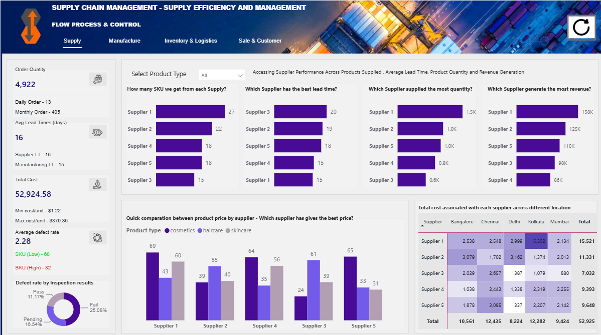
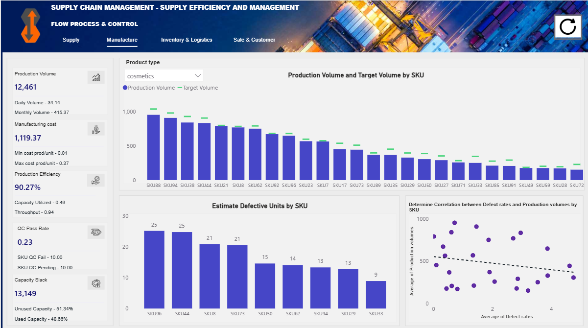
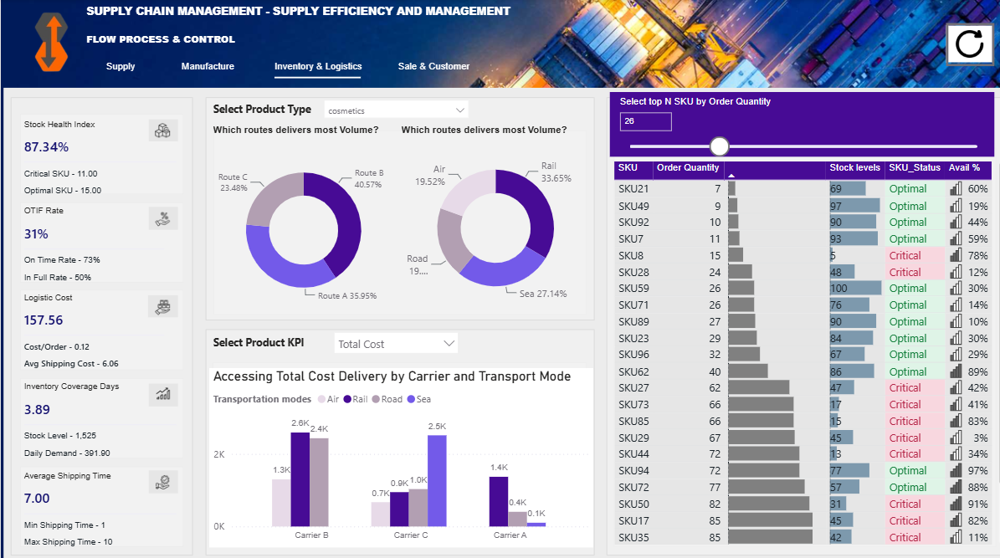
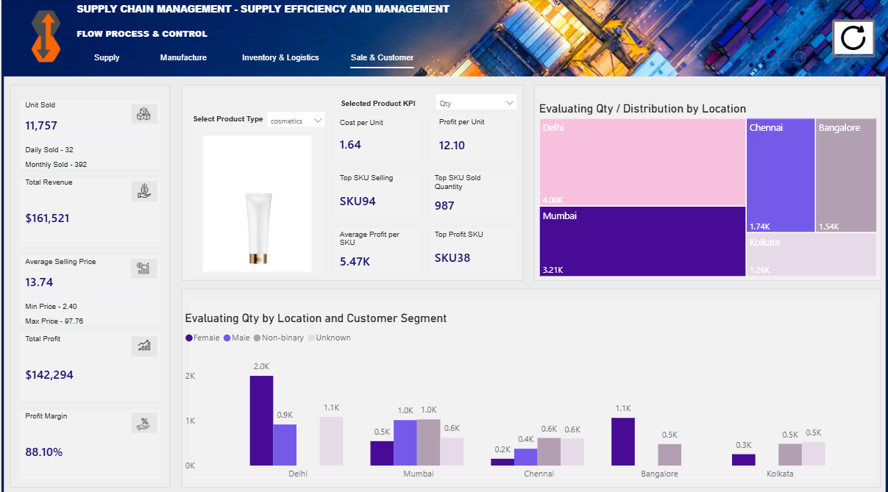

# Supply Chain Management Dashboard | Power BI Portfolio Project

## 1. Project Overview

This project is a **Supply Chain Management Dashboard** built in **Power BI** to analyze end-to-end operational performance across four major areas:

- **Supply Performance**
- **Manufacturing & Quality Control**
- **Inventory & Logistics**
- **Sales & Customer Analytics**

The objective of this project is not only to visualize data, but also to translate supply chain data into **actionable business insights** that can help a company improve supplier performance, manufacturing quality, inventory availability, delivery fulfillment, and sales profitability.

The dashboard was designed from the perspective of a **Business Analyst / Supply Chain Analyst**, focusing on answering practical business questions such as:

- Which suppliers create the most value and which ones carry operational risks?
- Which SKUs have high defect impact or production inefficiency?
- Why is order fulfillment performance not optimal?
- Which products, customer segments, and SKUs generate the highest revenue and profit?
- How can the business improve service level, reduce operational risk, and protect profitable SKUs?

---

## 2. Tools & Skills Used

- **Power BI Desktop**
- **DAX Measures**
- **Data Modeling**
- **Interactive Dashboard Design**
- **Bookmark Navigation**
- **Dynamic KPI Selector**
- **Top N Analysis**
- **Conditional Formatting**
- **Business Insight Generation**
- **Supply Chain Analytics**

---

## 3. Dataset Description

The dataset contains supply chain information at SKU level, including product, supplier, manufacturing, inventory, logistics, and sales data.

Key fields include:

| Category | Main Fields |
|---|---|
| Product | Product type, SKU, Price |
| Sales | Number of products sold, Revenue generated, Profit, Customer demographics |
| Supply | Supplier name, Location, Lead time, Order quantities, Costs |
| Manufacturing | Production volumes, Target Volume, Manufacturing costs, Manufacturing lead time |
| Quality Control | Inspection results, Defect rates, Defect category |
| Inventory | Stock levels, Daily demand, SKU status, Availability |
| Logistics | Shipping carriers, Shipping costs, Shipping times, Transportation modes, Routes, OnTime, InFull |

---

## 4. Dashboard Pages

### 4.1 Supply Performance

This page evaluates supplier contribution and risk by analyzing:

- SKU count by supplier
- Supplier lead time
- Ordered quantity by supplier
- Revenue generated by supplier
- Price difference across product types
- Cost by supplier and location
- Defect and inspection performance

### 4.2 Manufacturing & QC

This page focuses on production efficiency and product quality:

- Production volume
- Manufacturing cost
- Production efficiency
- QC pass rate
- Target achievement rate
- Production volume vs target volume by SKU
- Estimated defective units by SKU
- Relationship between production volume and defect rate

### 4.3 Inventory & Logistics

This page monitors inventory health and delivery performance:

- Stock health index
- OTIF rate
- Logistics cost
- Inventory coverage days
- Average shipping time
- Delivery volume/cost by carrier and transportation mode
- SKU-level stock, status, and availability analysis

### 4.4 Sales & Customer

This page evaluates business performance from the sales and customer perspective:

- Units sold
- Total revenue
- Average selling price
- Total profit
- Profit margin
- COGS per unit
- Profit per unit
- Top selling SKU
- Top profit SKU
- Customer segment and location performance

---

## 5. Key Metrics

| Metric | Value |
|---|---:|
| Total Revenue | 577,605 |
| Total Profit | 517,956 |
| Total Sold Quantity | 46,099 units |
| Ordered Quantity | 4,922 units |
| Production Volume | 56,784 units |
| Average Defect Rate | 2.28% |
| Total Supply / Route Cost | 52,925 |
| Total Shipping Cost | 555 |
| Critical SKU Count | 53 SKUs |
| Optimal SKU Count | 47 SKUs |

---

## 6. Business Insights

### Insight 1: Critical SKUs are the main fulfillment risk

The dashboard shows that **53 SKUs are classified as Critical**, while 47 SKUs are Optimal.

More importantly, Critical SKUs have much weaker fulfillment performance:

| SKU Status | SKU Count | Average Stock Level | InFull Rate | OnTime Rate |
|---|---:|---:|---:|---:|
| Critical | 53 | 22.5 | 18.9% | 86.8% |
| Optimal | 47 | 76.3 | 76.6% | 78.7% |

This indicates that the major issue is not only late delivery. The company is often able to deliver on time, but not always able to deliver complete orders.

**Business implication:**  
The company should prioritize improving **InFull Rate** for Critical SKUs by increasing safety stock, improving replenishment planning, and aligning production with demand.

---

### Insight 2: Supplier 1 is the strongest supplier, but InFull still needs improvement

Supplier performance varies significantly across revenue, profit, defect rate, and delivery service.

| Supplier | Revenue | Profit | Avg Defect Rate | OnTime Rate | InFull Rate |
|---|---:|---:|---:|---:|---:|
| Supplier 1 | 157,529 | 140,155 | 1.80% | 88.9% | 33.3% |
| Supplier 2 | 125,467 | 114,594 | 2.36% | 86.4% | 50.0% |
| Supplier 5 | 110,343 | 98,678 | 2.67% | 72.2% | 38.9% |
| Supplier 3 | 97,796 | 88,393 | 2.47% | 73.3% | 53.3% |
| Supplier 4 | 86,469 | 76,136 | 2.34% | 88.9% | 61.1% |

Supplier 1 generated the highest revenue and profit while maintaining the lowest defect rate. However, its InFull Rate is only 33.3%, indicating a fulfillment gap.

**Business implication:**  
Supplier 1 should be treated as a strategic supplier, but the company should negotiate better quantity fulfillment commitments or service-level agreements.

---

### Insight 3: Supplier 5 carries quality and reliability risk

Supplier 5 generated 110,343 in revenue and 98,678 in profit, but it also had the highest defect rate among suppliers at 2.67% and a relatively low OnTime Rate of 72.2%.

**Business implication:**  
Supplier 5 should be monitored as a quality-risk supplier. The company may need to increase incoming quality inspections or reduce order allocation for high-risk SKUs.

---

### Insight 4: Cosmetics has the lowest defect rate but the lowest production achievement

| Product Type | Production Volume | Target Volume | Achievement Rate | Avg Defect Rate | High Defect SKU |
|---|---:|---:|---:|---:|---:|
| Cosmetics | 12,461 | 13,804 | 90.27% | 1.92% | 6 |
| Haircare | 19,957 | 21,437 | 93.10% | 2.48% | 13 |
| Skincare | 24,366 | 26,465 | 92.07% | 2.33% | 13 |

Cosmetics has the best quality performance, with the lowest average defect rate and the fewest high-defect SKUs. However, its production achievement rate is the lowest among product types.

**Business implication:**  
Cosmetics may be a strong candidate for growth because of its better quality profile, but production capacity or planning should be improved to meet target volume.

---

### Insight 5: Haircare has the highest defect rate and should be prioritized for QC improvement

Haircare has an average defect rate of 2.48%, the highest among all product types, and has 13 high-defect SKUs.

**Business implication:**  
The company should prioritize QC improvement for Haircare by reviewing production processes, supplier inputs, and inspection standards.

---

### Insight 6: Sea transportation has the weakest logistics performance

| Transportation Mode | Revenue | Profit | OnTime Rate | InFull Rate |
|---|---:|---:|---:|---:|
| Rail | 164,990 | 146,077 | 82.1% | 57.1% |
| Road | 159,315 | 143,130 | 82.8% | 55.2% |
| Air | 155,735 | 141,275 | 88.5% | 34.6% |
| Sea | 97,564 | 87,474 | 76.5% | 29.4% |

Sea transportation has the lowest revenue contribution, the lowest OnTime Rate, and the lowest InFull Rate.

**Business implication:**  
Sea should not be prioritized for high-demand or critical SKUs. It may be more suitable for low-priority or less time-sensitive shipments.

---

### Insight 7: Carrier B shows the best overall balance

| Carrier | Revenue | Profit | Avg Defect Rate | OnTime Rate | InFull Rate |
|---|---:|---:|---:|---:|---:|
| Carrier B | 250,095 | 221,356 | 1.76% | 86.0% | 53.5% |
| Carrier C | 184,880 | 169,690 | 2.60% | 93.1% | 31.0% |
| Carrier A | 142,630 | 126,911 | 2.74% | 67.9% | 50.0% |

Carrier C has the highest OnTime Rate, but its InFull Rate is low. Carrier B has the strongest overall balance across revenue, profit, defect rate, and fulfillment.

**Business implication:**  
Carrier B should be prioritized for important shipments, while Carrier C may require further investigation into incomplete deliveries.

---

### Insight 8: Skincare is the strongest product type in sales

| Product Type | Revenue | Profit | Sold Quantity | Avg Defect Rate |
|---|---:|---:|---:|---:|
| Skincare | 241,628 | 217,344 | 20,731 | 2.33% |
| Haircare | 174,455 | 158,318 | 13,611 | 2.48% |
| Cosmetics | 161,521 | 142,294 | 11,757 | 1.92% |

Skincare generated the highest revenue, profit, and sold quantity. However, its defect rate is higher than cosmetics.

**Business implication:**  
Skincare should remain a key sales focus, but quality and inventory availability must be controlled carefully to avoid fulfillment issues.

---

### Insight 9: Unknown customer segment contributes the most revenue

| Customer Segment | Revenue | Profit | Sold Quantity |
|---|---:|---:|---:|
| Unknown | 173,090 | 152,995 | 15,211 |
| Female | 161,514 | 148,429 | 12,801 |
| Male | 126,634 | 114,362 | 7,507 |
| Non-binary | 116,366 | 102,171 | 10,580 |

The Unknown customer segment generated the highest revenue and sold quantity.

**Business implication:**  
The business is missing important customer information. Improving customer data collection can support better segmentation, targeting, and customer strategy.

---

### Insight 10: Top profit SKUs should be protected from stockout

| SKU | Product Type | Profit |
|---|---|---:|
| SKU51 | Haircare | 9,703 |
| SKU2 | Haircare | 9,576 |
| SKU31 | Skincare | 9,410 |
| SKU38 | Cosmetics | 9,395 |
| SKU88 | Cosmetics | 9,309 |

These SKUs generate the highest profit and should be treated as priority SKUs.

**Business implication:**  
The company should ensure stable stock availability for these SKUs and prioritize them in production, replenishment, and marketing.

---

### Insight 11: SKU91 requires immediate review

SKU91 is the worst-performing SKU by profit:

| SKU | Product Type | Profit | Cost per Unit |
|---|---|---:|---:|
| SKU91 | Cosmetics | -2,685 | 5.04 |

**Business implication:**  
SKU91 is destroying value. The company should review pricing, cost structure, sourcing, or consider discontinuing the SKU if profitability cannot be improved.

---

## 7. Business Recommendations

### Recommendation 1: Improve InFull performance for Critical SKUs

Critical SKUs have an InFull Rate of only 18.9%. This is one of the biggest operational bottlenecks.

Recommended actions:

- Increase safety stock for high-demand Critical SKUs
- Create automated alerts for low stock and high order quantity
- Improve replenishment planning based on Daily Demand
- Prioritize production for Critical SKUs with high revenue or profit impact

---

### Recommendation 2: Build a supplier scorecard

Supplier performance should be evaluated across multiple dimensions:

- Revenue contribution
- Lead time
- Defect rate
- Cost per unit
- OnTime Rate
- InFull Rate

This can help the company identify strategic suppliers, quality-risk suppliers, and suppliers that require renegotiation.

---

### Recommendation 3: Prioritize high-defect SKUs for QC improvement

The company should prioritize SKUs with defect rates above 4.75%, especially SKU42, SKU65, SKU1, SKU84, and SKU50.

Recommended actions:

- Review production process
- Trace supplier inputs
- Increase inspection frequency
- Monitor estimated defective units rather than only defect rate percentage

---

### Recommendation 4: Optimize logistics by balancing cost and service level

Carrier and transportation mode should not be selected only based on cost. They should be evaluated together with OnTime Rate, InFull Rate, and shipping time.

Recommended actions:

- Use Carrier B for important shipments
- Avoid Sea mode for Critical SKUs
- Investigate why Carrier C has high OnTime but low InFull

---

### Recommendation 5: Protect high-profit SKUs and review loss-making SKUs

Top-profit SKUs should receive priority in production and inventory planning. Loss-making SKUs such as SKU91 should be reviewed for pricing, cost, or discontinuation.

---

## 8. Key Learning

This project helped me understand that supply chain performance should be analyzed as an end-to-end system.

A supplier issue can affect production quality. Production defects can reduce good output. Low good output can create inventory shortages. Inventory shortages can reduce InFull performance. Poor fulfillment can eventually affect customer experience and sales performance.

The biggest lesson from this project is:

> A dashboard should not only show what happened. It should help the business decide what to do next.

---

## 9. Dashboard Preview


### Supply Performance


### Manufacturing & QC


### Inventory & Logistics


### Sales & Customer


---

## 10. Repository Structure

```text
Supply-Chain-PowerBI-Dashboard/
│
├── README.md
├── SCM Analyst.pbix
├── images/
│   ├── supply-page.png
│   ├── manufacturing-page.png
│   ├── inventory-logistics-page.png
│   └── sales-customer-page.png
└── data/
    └── supply-chain-dataset.xlsx
```

---

## 11. How to View the Dashboard

1. Download the `.pbix` file from this repository.
2. Open it using Power BI Desktop.
3. Use the navigation buttons to move across pages.
4. Use slicers and KPI selectors to explore supplier, manufacturing, inventory, logistics, and sales performance.

---

## 12. Conclusion

This Power BI dashboard provides a complete view of supply chain performance from supplier to customer. It helps identify key operational risks such as supplier quality issues, high-defect SKUs, inventory shortages, low InFull performance, logistics inefficiency, and unprofitable SKUs.

The project demonstrates how Power BI and DAX can be used not only for reporting, but also for business decision support.
